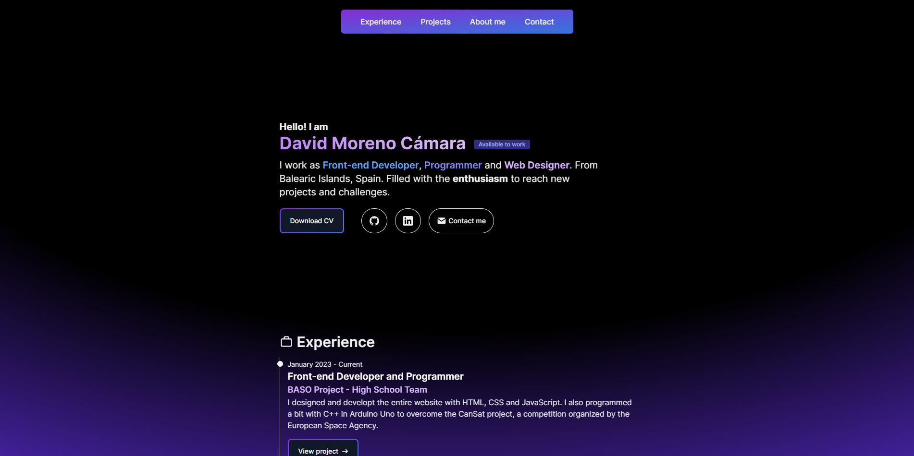

<h1 align="center"><b>Hi, I am David Moreno Cámara! </b></h1>

###  About me

I am a Junior Front-end Developer and a Web development student who is filled with the enthusiasm to start working in further projects. I consider myself a person that it's going to work very hard to overcome and achieve the challenges and goals I will have in my near future. 

Right now, I am expanding my knowledge to new technologies and languages through out Front-end development mainly, even so, I am open to learn Back-end as my final goal is to be a Full Stack developer. 

- ✔ Ask me about any doubt you have, I would be happy to help
- ✍ I am excited to join a development team to work hard and give all my strengths to improve myself and my skills in that environment.
- 📫 Reach me out via email: [davidmorecam@gmail.com](mailto:davidmorecam@gmail.com)

---

### 🛠️ Tech Stack

#### _Front-end 
 
  
  
  
  
  

#### _Back-end
 
  
  

#### _Other tools
 
  
  
  
  
  

#### _Learning...
 
  
  
  

### Portfolio
Make sure to visit [my web portfolio](https://dayv1d-portfolio.netlify.app) to see some details of my experience, other projects and more information about me, including my CV which is downloadable.

<!--
**Dayv1dDev/dayv1ddev** is a ✨ _special_ ✨ repository because its `README.md` (this file) appears on your GitHub profile.

Here are some ideas to get you started:

- 🔭 I’m currently working on ...
- 🌱 I’m currently learning ...
- 👯 I’m looking to collaborate on ...
- 🤔 I’m looking for help with ...
- 💬 Ask me about ...
- 📫 How to reach me: ...
- 😄 Pronouns: ...
- ⚡ Fun fact: ...
-->
